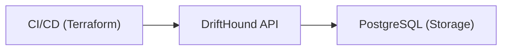

<div align="center">
  <h1>DriftHound</h1>
  <em>A Watchdog for Your Infrastructure State.</em>
  <div style="margin-top: 24px;"></div>


  <br />
  
  
  
</div>
<div style="margin-top: 24px;"></div>

## About
DriftHound is a Rails WebApp that receives Terraform drift reports via API and provides visibility into infrastructure drift across your projects.

## Features

- **API for Drift Reports**: Receive Terraform drift check results via authenticated API
- **Historical Data**: Store and track drift check history per project
- **Project Status**: Display project status (OK / Drift / Error / Unknown)
- **Web Dashboard**: View all projects and their drift status at a glance (coming soon)

## Requirements

- Ruby 3.x
- PostgreSQL
- Rails 8.0+

## Local Delevelopment

### Non-Docker Setup

1. **Install Dependencies**
  ```bash
  bundle install
  ```
2. **Database Setup**
  ```bash
  bin/rails db:create db:migrate
  ```
3. **Generate an API Token**
  ```bash
  bin/rails api_tokens:generate[my-ci-token]
  ```
  This will output a token to use in your API requests.
4. **Start the Server**
  ```bash
  bin/rails server
  ```

### Docker Setup

1. **Build and Start Services**
  ```bash
  docker-compose up --build
  ```
2. **Set Rails Master Key**
  - Make sure you have a `config/master.key` file. Set the environment variable `RAILS_MASTER_KEY` to its contents, or create a `.env` file with:
    ```
    RAILS_MASTER_KEY=your_master_key_here
    ```
3. **Provision the Database (inside the container)**
  ```bash
  docker-compose exec app bin/rails db:setup
  ```
  This will create, migrate, and seed the database.

4. **Generate an API Token (inside the container)**
  ```bash
  docker-compose exec app bin/rails api_tokens:generate[my-ci-token]
  ```
  This will output a token to use in your API requests.

## CLI Usage

DriftHound provides a Ruby CLI to automate drift checks and report results to the server. This is ideal for CI pipelines.

### Quick Install

You can install the CLI directly without cloning the repo:

```sh
sudo curl -L https://raw.githubusercontent.com/treezio/DriftHound/main/bin/drifthound-cli -o /usr/local/bin/drifthound && sudo chmod +x /usr/local/bin/drifthound
```

This will make the `drifthound` command available globally.

### Usage

```sh
bin/drifthound-cli --tool=terraform|terragrunt|opentofu \
  --project=PROJECT_KEY \
  --environment=ENV_KEY \
  --token=API_TOKEN \
  --api-url=http://localhost:3000 \
  --dir=PATH_TO_INFRA_DIR
```

#### Example

```sh
bin/drifthound-cli --tool=terragrunt --project=shipping --environment=production \
  --token=YOUR_API_TOKEN --api-url=http://localhost:3000 --dir=.
```

### Run the CLI via Docker

You can also run the CLI directly from the published Docker image, without installing Ruby or dependencies locally:

```sh
docker run --rm \
  -v "$(pwd)":/infra \
  -w /infra \
  ghcr.io/treezio/drifthound:<tag> \
  bin/drifthound-cli --tool=terraform|terragrunt|opentofu \
    --project=PROJECT_KEY \
    --environment=ENV_KEY \
    --token=API_TOKEN \
    --api-url=http://your-drifthound-server \
    --dir=.
```

Replace `<tag>` with the desired image version (e.g., `v0.1.0`).

This mounts your current directory into the container and runs the CLI as if it were installed locally.

#### Example

```sh
docker run --rm -v "$(pwd)":/infra -w /infra ghcr.io/treezio/drifthound:v0.1.0 \
  bin/drifthound-cli --tool=terragrunt --project=shipping --environment=production \
  --token=YOUR_API_TOKEN --api-url=http://localhost:3000 --dir=.
```


#### Options

| Option           | Required | Description                                  |
|------------------|----------|----------------------------------------------|
| `--tool`         | Yes      | `terraform`, `terragrunt`, or `opentofu`     |
| `--project`      | Yes      | Project key                                  |
| `--environment`  | Yes      | Environment key                              |
| `--token`        | Yes      | API token                                    |
| `--api-url`      | Yes      | DriftHound API base URL                      |
| `--dir`          | No       | Directory to run the tool in (default: `.`)  |

The CLI will run the specified tool's plan command, parse the output, and send a drift report to the API. The payload includes drift status, resource counts, duration, and the full plan output.

---

## API Usage

### Submit a Drift Check


```bash
curl -X POST \
  http://localhost:3000/api/v1/projects/my-project/environments/my-env/checks \
  -H "Authorization: Bearer YOUR_API_TOKEN" \
  -H "Content-Type: application/json" \
  -d '{
    "status": "drift",
    "add_count": 2,
    "change_count": 1,
    "destroy_count": 0,
    "duration": 8.2,
    "raw_output": "Plan: 2 to add, 1 to change, 0 to destroy."
  }'
```

### Request Parameters

| Parameter | Type | Required | Description |
|-----------|------|----------|-------------|
| `project_key` | string | Yes (URL) | Unique identifier for the project (alphanumeric, dashes, underscores) |
| `environment_key` | string | Yes (URL) | Unique identifier for the environment (alphanumeric, dashes, underscores) |
| `status` | string | Yes | One of: `ok`, `drift`, `error`, `unknown` |
| `add_count` | integer | No | Number of resources to add |
| `change_count` | integer | No | Number of resources to change |
| `destroy_count` | integer | No | Number of resources to destroy |
| `duration` | float | No | Execution duration in seconds |
| `raw_output` | text | No | Full Terraform plan output |

### Response

```json
{
  "id": 123,
  "project_key": "my-project",
  "status": "drift",
  "created_at": "2025-11-27T10:30:00Z"
}
```

### Status Values

| Status | Description |
|--------|-------------|
| `ok` | No drift detected - infrastructure matches state |
| `drift` | Drift detected - changes pending |
| `error` | Error running drift check |
| `unknown` | Initial state or unable to determine |

## API Token Management

```bash
# Generate a new token
bin/rails api_tokens:generate[token-name]

# List all tokens
bin/rails api_tokens:list

# Revoke a token
bin/rails api_tokens:revoke[TOKEN_ID]
```

## Running Tests

```bash
bin/rails test
```

## Docker

```bash
docker-compose up --build
```

## Architecture



## ToDo's

- Slack notifications: Send alerts when drift is detected

## License

MIT
