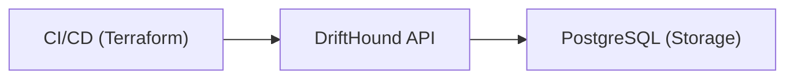

<div align="center">
  <h1>DriftHound</h1>
  <em>A Watchdog for Your Infrastructure State.</em>
</div>
<br>
<div align="center">

</div>
<br>
<p align="center">
  <a href="https://github.com/treezio/DriftHound/actions/workflows/ci.yml">
    
  </a>
  <a href="https://github.com/treezio/DriftHound/blob/main/.ruby-version">
    
  </a>
</p>

## What is DriftHound?
DriftHound is a Rails WebApp that receives Terraform drift reports via API and provides visibility into infrastructure drift across your projects.

## Features

- **API for Drift Reports**: Receive Terraform drift check results via authenticated API
- **Historical Data**: Store and track drift check history per project
- **Project Status**: Display project status (OK / Drift / Error / Unknown)
- **Web Dashboard**: View all projects and their drift status at a glance
- **Charts Dashboard**: Visual analytics with interactive charts for drift monitoring
- **Slack Notifications**: Real-time alerts when drift is detected or resolved

## Requirements

- Ruby 3.x
- PostgreSQL
- Rails 8.0+

## Local Delevelopment

### Non-Docker Setup

1. **Install Dependencies**
  ```bash
  bundle install
  ```
2. **Start database**
  ```bash
  docker compose up postgres -d
  ```

3. **Database Setup**
  ```bash
  bin/rails db:create db:migrate db:seed
  ```
1. **Start the Server**
  ```bash
  bin/rails server
  ```

#### Running Tests

> [!IMPORTANT]
> Running System tests requires google-chrome to be installed.

1. Create Test DB
  ```bash
  make prepare-test-db
  ```

2. Unit Tests
  ```bash
  make run-tests
  ```

### Docker Setup

**Provision Database and Start Application**
  ```bash
  make docker-db-setup
  ```
  This will start the services then create, migrate, and seed the database.
  Also automatically creates the API token in the seeding step.


## CLI Usage

DriftHound provides a CLI to automate drift checks in CI/CD pipelines.

### Quick Install

```sh
sudo curl -L https://raw.githubusercontent.com/treezio/DriftHound/main/bin/drifthound-cli -o /usr/local/bin/drifthound && sudo chmod +x /usr/local/bin/drifthound
```

### Usage Example

```sh
drifthound --tool=terraform \
  --project=my-project \
  --environment=production \
  --token=YOUR_API_TOKEN \
  --api-url=http://localhost:3000 \
  --dir=./terraform
```

📖 See [docs/cli-usage.md](docs/cli-usage.md) for detailed CLI documentation, Docker usage, and CI/CD integration examples.

---

## API Usage

You can submit drift check results directly to the API:

```bash
curl -X POST \
  http://localhost:3000/api/v1/projects/my-project/environments/my-env/checks \
  -H "Authorization: Bearer YOUR_API_TOKEN" \
  -H "Content-Type: application/json" \
  -d '{
    "status": "drift",
    "add_count": 2,
    "change_count": 1,
    "destroy_count": 0,
    "duration": 8.2,
    "raw_output": "Plan: 2 to add, 1 to change, 0 to destroy."
  }'
```

**Generate an API Token:**

1. Log in as admin at `/login`
2. Click **API Tokens** in the navigation bar
3. Create a new token and copy it (it's only shown once!)

📖 See [docs/api-usage.md](docs/api-usage.md) for complete API documentation, including advanced features and examples.

---

## GitHub Actions Integration

Automate drift detection in your GitHub workflows with the official DriftHound GitHub Action.

🔄 **GitHub Action**: [https://github.com/treezio/drifthound-action](https://github.com/treezio/drifthound-action)

---

## Deployment

DriftHound can be deployed to production environments using Docker and Kubernetes.

### Docker Images

Pre-built Docker images are available in the GitHub Container Registry:

```bash
docker pull ghcr.io/treezio/drifthound:latest
```

### Kubernetes Deployment

A Helm chart is available for deploying DriftHound to Kubernetes clusters:

📦 **Helm Chart Repository**: [https://github.com/treezio/helm-chart-drifthound/](https://github.com/treezio/helm-chart-drifthound/)

For deployment instructions and configuration options, refer to the Helm chart documentation.

---

## Documentation

- **[Configuration Guide](docs/configuration.md)** - Environment variables, database setup, Slack configuration, and deployment examples
- **[CLI Guide](docs/cli-usage.md)** - Detailed CLI documentation, Docker usage, and CI/CD integration examples
- **[API Reference](docs/api-usage.md)** - Complete API documentation, advanced features, and integration examples
- **[Slack Notifications](docs/slack-notifications.md)** - Configure Slack alerts for drift detection

## Architecture



## License

AGPL-3.0
